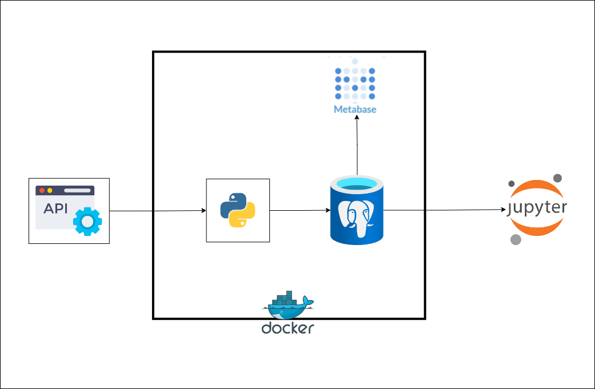

## Project Overview
This project involves extracting country data from a public REST API, transforming the data, loading it into a database, and analyzing it to gain insights. The data is used to answer specific analytical questions and visualize the results in a dashboard.

## Data Source
- REST API: [REST Countries](https://restcountries.com/v3.1/all)

## Extracted Fields
- Country Name
- Independence
- United Nation Member
- Start of Week
- Official Country Name
- Common Native Name
- Currency Code
- Currency Name
- Currency Symbol
- Country Code (IDD)
- Capital
- Region
- Sub Region
- Languages
- Area
- Population
- Continents

## Architecture Diagram


## Tools Used
- Python
- Metabase
- Pgadmin
- Postgres
- Docker

## Dependencies
- requests
- pandas
- dotenv
- psycopg2

## Getting Started
### Running without Docker
1. Make sure you have Pgadmin and Postgres on your PC.

2. Clone the repository.
```bash
git clone https://github.com/SammyGIS/dec-hackathon-team-1-solution.git
```
After cloning the repo, edit the `.env_file`, rename it to `.env`, and store your login credentials there.

3. Install required dependencies.
```bash
pip install -r requirements.txt
```

4. Run the script in the CLI to extract, transform, and load the data into the database.
```bash
python main.py
```

5. You can then perform your analysis in Pgadmin. You can also connect it to any database system you have on your PC. All you need to do is add the host, port, password, and default database name in the `.env` file.

### Running with Docker
This is the best way to enjoy what we built. This way, all systems are connected seamlessly. If you're on Windows, you can install Docker from [Docker Hub](https://www.docker.com/products/docker-desktop/).

1. Start Docker on your CLI.
2. Clone the repository.
```bash
git clone https://github.com/SammyGIS/dec-hackathon-team-1-solution.git
```
3. To address issues of conflicting ports, you can clear any running containers or change the port in the `docker-compose.yaml` file.
4. open your cli, chnage to the directory you cloned in step 2, build the Docker images uisng the command.
```bash
docker-compose build
```
4. Run the containers in detached mode.
```bash
docker-compose up -d
```
This automatically runs all the processes defined in the workflow. You can access your Pgadmin via `localhost:8080` to running some sql codes or connect your pgdatavase to metabase and run metabase visualization app via `localhost:3000`.


4. Connecting pgAdmin to Your PostgreSQL Database
    1. **Run the Server**
        - Start the server by running `localhost:8080` in your browser.
    2. **Sign in to pgAdmin**
        - Open pgAdmin and sign in with your credentials; check the docker compose file.
    3. **Create a New Server**
        - Right-click on `Servers`.
        - Click on `Create` and then `Server`.
    4. **Enter Server Details**
        - Enter the server name (e.g., `pgdatabase`).
    5. **Configure Connection**
        - Go to the `Connection` tab.
        - In the `Host` section, enter `pgdatabase` (as defined in your Docker Compose file).
        - Enter your `Username`, `Password`, `Port`, and the default `Database name`.
    6. **Finalize the Connection**
        - Click `Save` to connect pgAdmin to your PostgreSQL database.
    7. **Access the Database**
        - Once connected, you will see the `countries_db` database already created.
        - Open the `countries_db` database.
    8. **Navigate to Schema**
        - Go to `Schemas`.
        - Open the `public` schema.
    10. **Access Tables**
        - Open `Tables` to see your table.
    11. **Open Query Tool**
        - Right-click on the table and select `Query Tool`.
        - Start writing your SQL queries to solve the analysis problem.

5. Whenever your are done with closed it using the command
```bash
docker-compose down
```

## Dashboard using Metabase

## Analytical Questions
1. How many countries speak French?
2. How many countries speak English?
3. How many countries have more than 1 official language?
4. How many countries' official currency is Euro?
5. How many countries are from Western Europe?
6. How many countries have not yet gained independence?
7. How many distinct continents and how many countries from each?
8. How many countries' start of the week is not Monday?
9. How many countries are not United Nation members?
10. How many countries are United Nation members?
11. Least 2 countries with the lowest population for each continent
12. Top 2 countries with the largest area for each continent
13. Top 5 countries with the largest area
14. Top 5 countries with the lowest area

