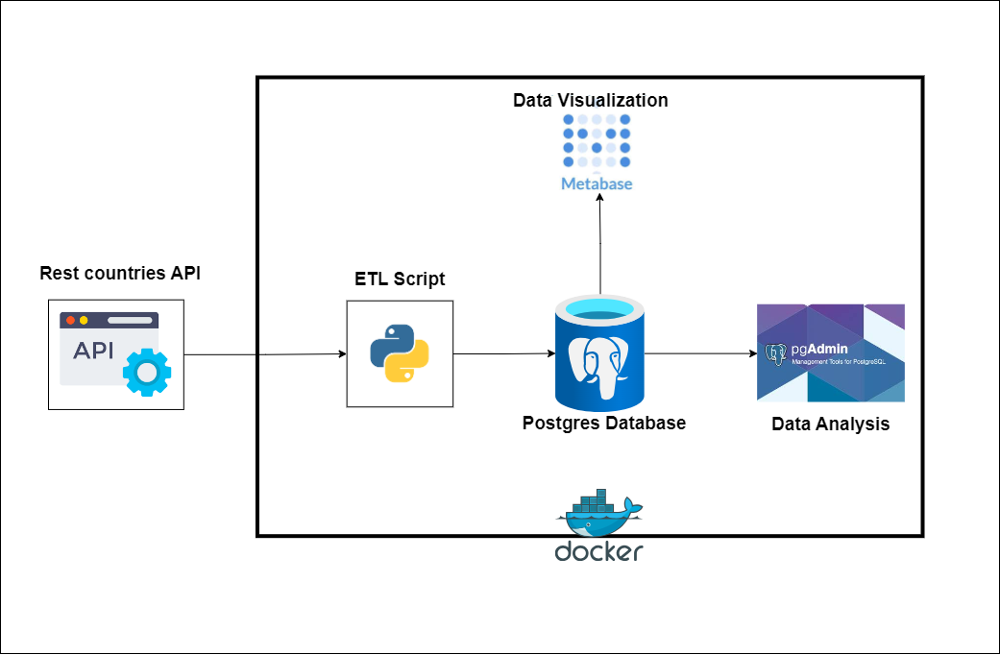
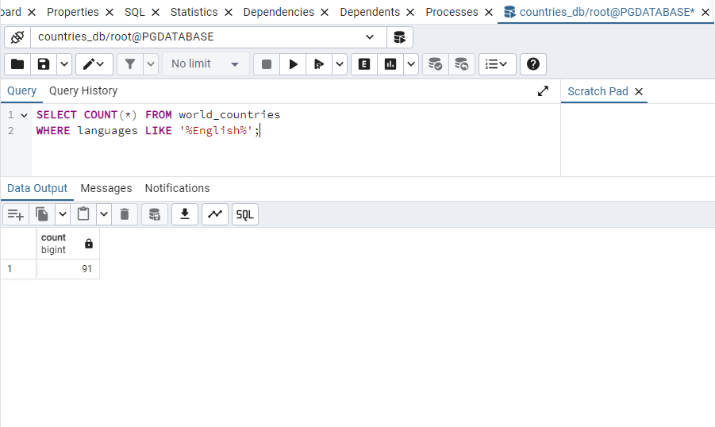

## Overview
Project Overview
This project focuses on leveraging country data to provide valuable insights for travel agencies. The workflow involves extracting data from a public REST API, transforming and loading it into a database, and then analyzing it to generate actionable insights. These insights will be used to enhance travel recommendations for customers.

### Objectives
* Provide Recommendations: The processed data will be utilized by travel agencies to offer personalized travel recommendations to customers.
* Enhance Decision-Making: Generate actionable insights that can guide travel planning and customer engagement strategies.
* Streamline Data Management: Employ a robust architecture that ensures data consistency and ease of access for analysis and visualization.

## Data Source
- REST API: [REST Countries](https://restcountries.com/v3.1/all)

## Extracted Fields
## Data Dictionary

- **Country Name:** The commonly used name of the country.
- **Independence:** The date the country gained independence.
- **United Nation Member:** Indicates if the country is a member of the United Nations.
- **Start of Week:** The day the week officially starts in the country.
- **Official Country Name:** The formal or official name of the country.
- **Common Native Name:** The name of the country in its native language.
- **Currency Code:** The ISO code for the country's currency.
- **Currency Name:** The name of the country's currency.
- **Currency Symbol:** The symbol used to represent the country's currency.
- **Country Code (IDD):** The international dialing code for the country.
- **Capital:** The capital city of the country.
- **Region:** The geographical region where the country is located.
- **Sub Region:** A more specific geographical area within the region.
- **Languages:** The languages spoken in the country.
- **Area:** The total land area of the country in square kilometers.
- **Population:** The estimated population of the country.
- **Continents:** The continent or continents on which the country is located.
- **Latitude:** The latitude coordinate of the country.
- **Longitude:** The longitude coordinate of the country.

## Architecture Diagram


## Why This Architecture
We chose this architecture for its simplicity and efficiency. Given the nature of the data, which is small and rarely changes, extensive automation and complex setups would be unnecessary and resource-intensive. Here's why we opted for this approach:

- **Simplicity:** The data is small and can be handled easily without the need for batch loading.
- **Efficiency:** Automation is not required as the data rarely changes, saving time and resources.
- **Speed:** The data can be extracted and loaded into the database within a minute.
- **Minimal Setup:** We decided against using a staging database or data lake due to the manageable size of the data.
The only aspect of the data that might change is the population, which is updated every ten years through a census conducted across different counties. Most of the population data are estimates rather than actual counts. This streamlined approach ensures quick and effective data processing while avoiding unnecessary complexity.

## Tools Used
**Python for ETL:**
- Python serves as the primary language for Extract, Transform, Load (ETL) processes.
- Utilizes powerful libraries such as Pandas, requests, and pyscopg2 for data manipulation and database interaction.
- Automates the extraction of data from source and tansfrom it into usable formats, then load  the data into databases.

**Metabase for Data Visualization:**
- Metabase is used for creating interactive and insightful data visualizations.
- Connects seamlessly to the Postgres database to visualize data in real-time.

**Postgres for Database Management:**
- PostgreSQL (Postgres) is the database system for storing and managing data.
- Known for its robustness, scalability, and support for complex queries.

**pgAdmin for Database Management:**
- pgAdmin is the tool for managing the Postgres database.
- Offers a user-friendly interface for database administration tasks.
- Facilitates tasks such as querying, data modeling, and database monitoring.

**Docker for Managing Services:**
- Docker is used to containerize all services listed above, ensuring consistency and isolation.
- Simplifies deployment and scaling by running everything inside Docker containers.
- Ensures seamless integration and orchestration of Python scripts, Metabase, Postgres, and pgAdmin.

By leveraging these technologies, the workflow is streamlined, efficient, and scalable, allowing for robust data processing, management, and visualization within a consistent and isolated environment.


## Python Dependencies
- requests
- pandas
- dotenv
- psycopg2

## Getting Started
### Running without Docker
1. Make sure you have Pgadmin and Postgres on your PC.

2. Clone the repository.
```bash
git clone https://github.com/SammyGIS/dec-hackathon-team-1-solution.git
```
After cloning the repo, edit the `.env_file`, rename it to `.env`, and store your login credentials there.

3. Install required dependencies.
```bash
pip install -r requirements.txt
```

4. Run the script in the CLI to extract, transform, and load the data into the database.
```bash
python etl_script.py
```

5. You can then perform your analysis in Pgadmin. You can also connect it to any database system you have on your PC. All you need to do is add the host, port, password, and default database name in the `.env` file.

### Running with Docker
This is the best way to enjoy what we built. This way, all systems are connected seamlessly. If you're on Windows, you can install Docker from [Docker Hub](https://www.docker.com/products/docker-desktop/).

1. Start Docker on your CLI.
2. Clone the repository.
```bash
git clone https://github.com/SammyGIS/dec-hackathon-team-1-solution.git
```
3. To address issues of conflicting ports, you can clear any running containers or change the port in the `docker-compose.yaml` file.
4. open your cli, chnage to the directory you cloned in step 2, build the Docker images uisng the command.
```bash
docker-compose build
```
4. Run the containers in detached mode.
```bash
docker-compose up -d
```
This automatically runs all the processes defined in the workflow. You can access your Pgadmin via `localhost:8080` to running some sql codes or connect your pgdatavase to metabase and run metabase visualization app via `localhost:3000`.


4. Connecting pgAdmin to Your PostgreSQL Database
    1. **Run the Server**
        - Start the server by running `localhost:8080` in your browser.
    2. **Sign in to pgAdmin**
        - Open pgAdmin and sign in with your credentials; check the docker compose file.
    3. **Create a New Server**
        - Right-click on `Servers`.
        - Click on `Register` and then `Server`.
    4. **Enter Server Details**
        - Enter the server name (e.g., `PGDATABASE`).
    5. **Configure Connection**
        - Go to the `Connection` tab.
        - In the `Host` section, enter `pgdatabase` (as defined in your Docker Compose file).
        - Enter your `Username`, `Password`, `Port`, and the default `Database name`.
    6. **Finalize the Connection**
        - Click `Save` to connect pgAdmin to your PostgreSQL database.
    7. **Access the Database**
        - Once connected, you will see the `countries_db` database already created.
        - Open the `countries_db` database.
    8. **Navigate to Schema**
        - Go to `Schemas`.
        - Open the `public` schema.
    10. **Access Tables**
        - Open `Tables` to see your table.
    11. **Open Query Tool**
        - Right-click on the table and select `Query Tool`.
        - Start writing your SQL queries to solve the analysis problem.

5. Whenever your are done with closed it using the command
```bash
docker-compose down
```

## Dashboard using Metabase
### image Analytics


### image Query


### image Map Viz


## Analytical Questions
1. How many countries speak French?

2. How many countries speak English?

3. How many countries have more than 1 official language?

4. How many countries' official currency is Euro?

5. How many countries are from Western Europe?

6. How many countries have not yet gained independence?

7. How many distinct continents and how many countries from each?

8. How many countries' start of the week is not Monday?

9. How many countries are not United Nation members?

10. How many countries are United Nation members?

11. Least 2 countries with the lowest population for each continent

12. Top 2 countries with the largest area for each continent

13. Top 5 countries with the largest area

14. Top 5 countries with the lowest area


